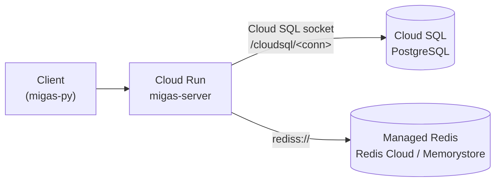

# Cloud Hosting (GCP)

Migas runs in production at [migas.nipreps.org](https://migas.nipreps.org) on
Google Cloud: the container on Cloud Run, Postgres on Cloud SQL, a managed Redis,
and images built by Cloud Build. This is that setup.

The image and environment variables are the same on any container platform (AWS
ECS/Fargate, Azure Container Apps, Kubernetes); GCP is just the worked example.

> For a local instance see [getting started](getting-started.md); for your own
> host see [self-hosting](self-hosting.md). The
> [configuration reference](self-hosting.md#6-configuration-reference) there
> covers the environment variables used below.

## Contents

1. [Architecture on GCP](#1-architecture-on-gcp)
2. [Prerequisites](#2-prerequisites)
3. [Provision Cloud SQL (PostgreSQL)](#3-provision-cloud-sql-postgresql)
4. [Provision Redis](#4-provision-redis)
5. [Initialize the schema](#5-initialize-the-schema)
6. [Deploy](#6-deploy)
7. [Bootstrap the admin token](#7-bootstrap-the-admin-token)
8. [Post-release cost management](#8-post-release-cost-management)

---

## 1. Architecture on GCP



- **Cloud Run** runs the container built from the repo `Dockerfile`
  (`BUILDTYPE=release`), scaling instances with traffic and reachable publicly
  (`--allow-unauthenticated`). Cloud Run terminates TLS, so the server runs with
  `--proxy-headers --forwarded-allow-ips='*'`.
- **Cloud SQL** holds the database. Setting `GCP_SQL_CONNECTION` makes the server
  connect over the `/cloudsql/<project:region:instance>` Unix socket (see
  `connections.py`).
- **Redis** is any managed instance Cloud Run can reach. Production uses a free
  [Redis Cloud](https://app.redislabs.com/) instance; Memorystore also works.
- **Geolocation databases** are baked into the image at build time (the deploy
  pipeline runs `scripts/download_geodbs.py` before the build), so there is no
  runtime download and `MIGAS_GEOLOC=1` is set.

---

## 2. Prerequisites

- A GCP project with billing enabled and the [`gcloud` SDK](https://cloud.google.com/sdk/docs/install)
  authenticated (`gcloud auth login`, `gcloud config set project <id>`).
- Enabled APIs: Cloud Run, Cloud Build, Cloud SQL Admin, Artifact/Container
  Registry.
- A managed Redis instance and its connection URI.
- `uv` and `hatch` locally for manual deploys (the version tag comes from
  `hatch version`).

The commands below use a `$REGION` shell variable. Set it first:

```bash
export REGION=us-central1   # or your preferred region
```

---

## 3. Provision Cloud SQL (PostgreSQL)

Create the instance and the `migas` database, or let
[`deploy/gcp/release-gcp.sh`](../deploy/gcp/release-gcp.sh) create them if they
are missing. Use the newest PostgreSQL major your provider offers; `POSTGRES_18`
is current on Cloud SQL at the time of writing.

```bash
gcloud sql instances create migas-postgres \
  --database-version=POSTGRES_18 \
  --region=$REGION \
  --tier=db-g1-micro \
  --root-password='<choose-a-strong-password>'

gcloud sql databases create migas --instance=migas-postgres
```

The connection name is `project_id:region:instance_name` (e.g.
`<project-id>:$REGION:migas-postgres`); that is your `GCP_SQL_CONNECTION`.

---

## 4. Provision Redis

Create a managed Redis instance (Redis Cloud free tier or Memorystore) and note
its URI. Pass it as `MIGAS_REDIS_URI`, or `REDIS_TLS_URL` for a `rediss://`
endpoint.

---

## 5. Initialize the schema

Cloud Run does not run migrations, so apply them yourself: once at setup, and
again after any release that adds one. The easiest route is the
[Cloud SQL Auth Proxy](https://cloud.google.com/sql/docs/postgres/connect-auth-proxy):

```bash
# In one terminal, open a local tunnel to the instance:
cloud-sql-proxy <project-id>:$REGION:migas-postgres

# In another, point Alembic at the tunnel and migrate:
DATABASE_URL="postgresql+asyncpg://postgres:<password>@127.0.0.1:5432/migas" \
  uv run alembic upgrade head
```

That creates the `migas` schema and tables. The self-hosting guide's
[schema section](self-hosting.md#5-initialize-the-database-schema) has the
details.

---

## 6. Deploy

### Automated

Production deploys run through the
[`prod-deploy.yml`](../.github/workflows/prod-deploy.yml) workflow on a tag push:

```bash
git tag -a 1.2.3 -m "Release 1.2.3"
git push origin 1.2.3
```

It authenticates via Workload Identity, builds the image with Cloud Build
(skipping the build if the tag's image already exists), rolls out a new Cloud Run
revision, and creates a GitHub Release for annotated tags.

Required repository secrets:

| Secret | Purpose |
|---|---|
| `PROJECT_ID` | GCP project id |
| `WORKLOAD_IDENTITY_PROVIDER`, `SERVICE_ACCOUNT` | Keyless GCP auth |
| `GCP_SQL_CONNECTION` | `project:region:instance` |
| `DATABASE_USER`, `DATABASE_PASSWORD`, `DATABASE_NAME` | Cloud SQL credentials |
| `REDIS_URI` | Maps to `MIGAS_REDIS_URI` |
| `MAX_REQUEST_SIZE` | Maps to `MIGAS_MAX_REQUEST_SIZE` |

### Manual

To deploy from your workstation, run the script (or `make release-gcp`):

```bash
# Provide PROJECT_ID, SQL_INSTANCE_PASSWORD, and REDIS_URI in the environment,
# or a deploy/gcp/.env file (see deploy/gcp/example.env).
./deploy/gcp/release-gcp.sh
```

It creates the Cloud SQL instance if needed, builds via Cloud Build
([`cloudbuild.yml`](../deploy/gcp/cloudbuild.yml)), and deploys. The deploy
command itself is:

```bash
gcloud run deploy migas-server \
  --region=$REGION \
  --image=gcr.io/$PROJECT_ID/migas-server:<version> \
  --platform=managed \
  --min-instances=1 --max-instances=3 \
  --ingress=all --allow-unauthenticated \
  --set-cloudsql-instances=$GCP_SQL_CONNECTION \
  --memory=512Mi --cpu=1 --cpu-throttling \
  --args=--host,0.0.0.0,--port,8080,--proxy-headers,--forwarded-allow-ips='*' \
  --set-env-vars="MIGAS_GEOLOC=1|MIGAS_REDIS_URI=...|DATABASE_USER=...|DATABASE_PASSWORD=...|DATABASE_NAME=migas|GCP_SQL_CONNECTION=$GCP_SQL_CONNECTION"
```

> `--set-cloudsql-instances` attaches the socket, and `GCP_SQL_CONNECTION` tells
> the server to use it. `--forwarded-allow-ips='*'` is fine here because only
> Cloud Run's front end can reach the container.

---

## 7. Bootstrap the admin token

A fresh database has no master token, and the API can't create one. Run the
[bootstrap script](self-hosting.md#11-bootstrap-the-first-admin-token) over the
Auth Proxy, the same way as the migration above:

```bash
cloud-sql-proxy <project-id>:$REGION:migas-postgres -p <PORT>

# in a separate terminal
DATABASE_URL="postgresql+asyncpg://postgres:<password>@127.0.0.1:<PORT>/migas" \
  uv run python scripts/bootstrap_admin_token.py
```

Save the printed token; it's your admin credential for the deployed instance.

---

## 8. Post-release cost management

Each Cloud Run revision keeps the `min-instances` it was deployed with, so an old
revision deployed with `--min-instances=1` keeps a warm, billable container even
at 0% traffic. Once a release looks healthy:

```bash
gcloud run revisions list --service=migas-server --region=$REGION

# Stop idle billing on old revisions (keeps them as rollback candidates):
gcloud run revisions update <old-revision> --min-instances=0 --region=$REGION

# Delete revisions older than your last 1–2 rollback candidates:
gcloud run revisions delete <very-old-revision> --region=$REGION
```
